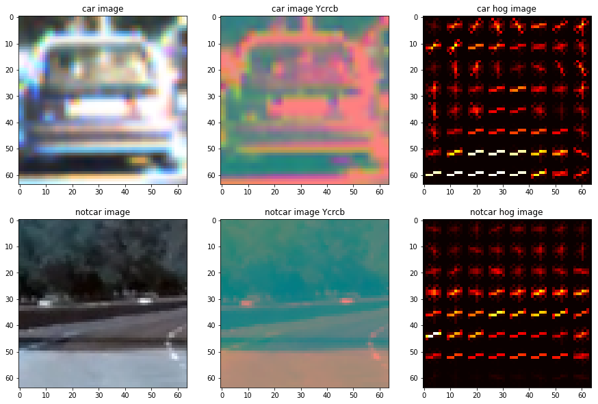
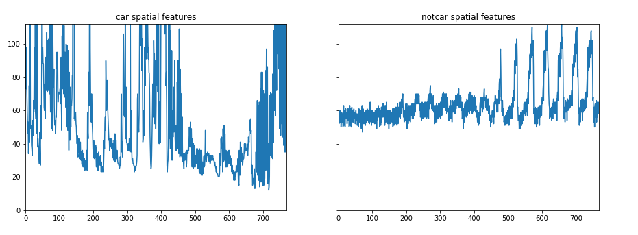
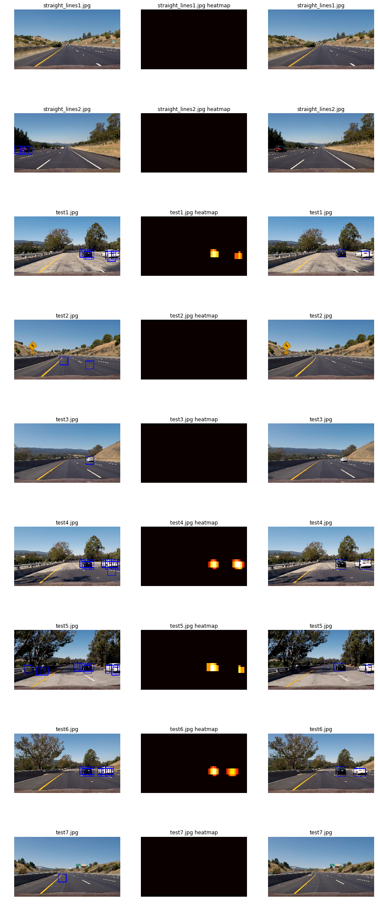

## Writeup
----

**Vehicle Detection Project**

The goals / steps of this project are the following:

* Training a SVM classifier to distinguish an image from vehicle and non vehicle objects. The following features in the image used to train the classifier
    * Spatial binned colored features
    * Histogram of colors
    * Histogram of colored gradients

* Implementation of sliding window technique accross the image to detec vehicles in the image
* Implmentation of the algorithm on a video stream and application
* Application of heatmap and labels to eliminate false positives and detecting bounding boxes for identified vehicles

[//]: # (Image References)
[image1]: (./examples/car_not_car.png)
[image2]: ./examples/HOG_example.jpg
[image3]: ./examples/sliding_windows.jpg
[image4]: ./examples/sliding_window.jpg
[image5]: ./examples/bboxes_and_heat.png
[image6]: ./examples/labels_map.png
[image7]: ./examples/output_bboxes.png
[video1]: ./project_video.mp4

## [Rubric](https://review.udacity.com/#!/rubrics/513/view) Points
### Here the rubric points considered and described how  each point is addressed in the implementation.  

----

## Training of the SVM Classifier

A Support Vector Machine(SVM) is used in this project to detect the vehicles in an image. The SVM is trained as a binary classifier which classifies a given image into vehicle and non vehicle image. The SVM is trained using a labeled data provided by Udacity based on  GTI vehicle image database and KITTI vision benchmark suite. The dataset contains about 8800 images in each of the vheicle and non-vehicle categories. Each image in the traning dataset is of size 64 X 64 pixels, which is an approprioate size of a widow used in the image. For each input image several windows are slide accross the image and each window is passed to the SVM which classifies if the window is a image of a vehicle or not. The SVM is trained by extracting the following features from the input image

    - Spatial binned colored features
    - Histogram of colors
    - Histogram of colored gradients
    
### Histogram of Colored Gradients

Histogram of colored gradients(HOG) is the most important feature by the SVM to distinguish vehicle and non vehicle image.HOG of an image identifies the edges of the image and so the shape of the objects is detectable. The following image shows the HOG of a vehicle and HOG of a non vehicle images. 

From the above image the differences between vehicle and non vehicle images are clearly visible. The outer shape of the vehicle is easily visible and also the objects in the vehicle such as taillights, tires are also visible. These details are used by the SVM to classify the images. The following parameters are used in the during the extraction of hog features during training and implementaiton. 

| Parameter|Value|
|:-:|:-:|
|Orientation|9|
|Pixels per cell| 8|
|Cells per Block|2|
|HOG Channels|Grey|

Choosing parameters for HOG is trade off between the speed and accuracy. For example the orientation, which parameter defines the bins used in calculating histogram of gradients, a high value of orientation improves the accuracy of the classifier but reduces the speed. The parameters above are chosen based on several trials. The parameter pixel per cell and cells per block decides the number of features. Having higher feature length increases the accuracy of the classifier but decreases the speed. The hog channel parameter grey means that the image is converted to grayscale before hog was calculated.

### Histogram of Color Spaces

The histogram of color is also a useful feature used for training the classifier since most vehicles have same colour throughout its body. If the color space is switched from RGB to other color spaces such as LUV or YcrCb the histogram of color channels is even more useful to distinguish vehicle and non vehicle images. In this project YCrCb color space is used. The following image shows the difference between vehicle and non vehicle images.

### Spatial Features

Spatial features are extracted by just reducing the size of the image and arranging all the pixel values into a feature vector. The spatial feature has different for vehicle images and non vehicle images which is shown in the figure below.

with the chosen set of parameters for extracting the features during the training of SVM, it acheives an accuracy of 99.32% for a feature vector of length 2628 for 64 X 64 window.

   ## Sliding Window and HOG Subsampling Methods

The vehicle detection pipeline involves detecting vehicles in predefined regions called windows thorughtout the image. The features of the image are extracted from the image and classifed by the SVM.To define windows there are two methods sliding window method and hog subsampling method. In the sliding window method the windows of predefined sizes are swept thoughout the image and the image in the window is classified. This method is straight forward but computaion intesive as it involves calculating the HOG values of image for each window. The subsampling method is more efficient computationally since it involves calculating the HOG values once for overall image and the features are extracted from the precalulated HOG values with defined window sizes. In this project HOG subsampling method is used. The following pictures show the windows used in the image.

In the Subsampling method the window sizes cannot be defined accurately since the whole image is scaled by a factor and keeping the window size constant, which is equal to the size of image used for training the classifier. The scaling factor determins the window sizes smallar the scaling factors smaller the window sizes. In this project three scaling factors are used in the following y axis ranges as shown in the table below

|Scaling Factor|Y Start(pixels)|Y Stop(pixels)|
|:-:|:-:|:-:|
|1.2|400|528|
|1.4|400|656|
|2.2|464|720|

In the subsampling method there is parameter called pixels per step which determines the overlap between the windows. The pixel per step is kept at 2 which corresponds to a overlap of 0.75 if pixels per cells value is equal to 8.

The pictures below shows the ouput of the pipeline for the test images.

The images in the left side of the pictures show the output of the classifier and subsampling method. These images contains several hits for the same vehicle and also contain some false positives. The image in the centre show the heatmap and the images in the right shows the final labels for vehicles. 

### Heatmaps and Labels

The heatmaps and labels are used to eliminate the false positives found by the pipeline and to calculate the boundaries of the detected objects. Heatmap is nothing but the cummulative sum of the windows where vehicles are identified. Since there is a overlap between windows and there are windows of several sizes the algorithm detects an vehicle multiple times even in a single frame. This helps to eliminate false positives identified for non vehicle objects because they are identified less frequently. These false positives are eliminated by applying heatmap threshold. It can be seen from the obove example images that for many of the false positives there is low heatmap and these are eliminated in the right side images.

Labels are used to calculate the bounding boxes of the identified vehicles. The label function from scipy module calculates the bounding box of objects based on the heatmap.Label function returns the location of bounding boxes and the number of identified objects. The right side images in the above pictures are the labeled objects based on the heatmap

## Video Implementation

The vehicle detection pipeline discussed above is applied on a video using the python moviepy module. The moviepy module gets an image processing function, which gets an input images and provides a output image. Then this is function is used by moviepy module to process individual frames of the a video file. In case of videos the location of vehicle objects do not change so much between the nearest frames and so taking heatmap across few frames will provide a smooth and robust location of the objects. In this project the heatmap is accumulated over 10 frames and this is used to label the vehicles. This also helps to eliminate some of the false positives too. The output [video](https://github.com/laljarus/Vehicle-Detection-and-Tracking/blob/master/project_video_output.mp4) identifies the vehicles successfully.

## Conclusion

The algorithm successfully identifies and tracks the vehicles on the road closer to camera. The usage of techniques such as heatmaps and labels eliminates identification of non vehicles as vehicle. But there are still some false positive detection in the video. Having said this there are some drawbacks in the algorithm too. The algorithm is very slow it is able to generate ouputs only 2 frames per second. So this cannot be used in real time in a vehicle. The algorithm is highly dependent on the parameters used and so is not robust for different weather and lighting conditions.
